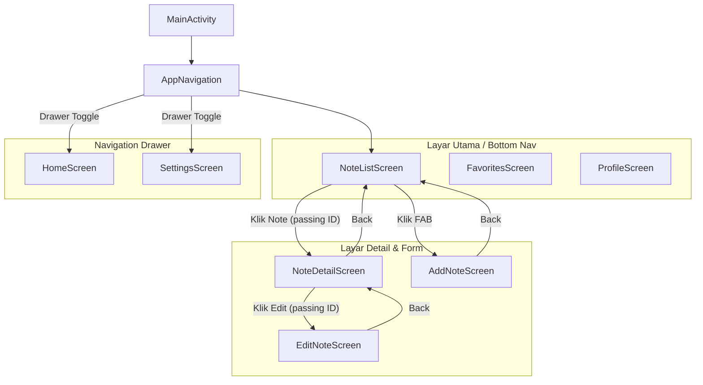

# Tugas Praktikum 5: Notes App dengan Navigasi Multi-Screen

Proyek ini adalah aplikasi manajemen catatan (Notes) yang dibangun menggunakan **Kotlin Multiplatform (Android)** dengan **Jetpack Compose**. Fokus utama tugas ini adalah implementasi navigasi antar layar menggunakan `Jetpack Navigation Component`.

---

## 🛠️ Fitur Aplikasi & Bukti Implementasi

### 1. Bottom Navigation 
- **Lokasi Kode:** `app/src/main/java/com/example/tugas5/navigation/BottomNavBar.kt`
- **Deskripsi:** Terdapat 3 tab (Notes, Favorites, Profile). Tab yang aktif di-highlight menggunakan `currentBackStackEntryAsState`. Navigasi menggunakan `popUpTo` dan `launchSingleTop` untuk optimasi stack.

**Screenshot Fitur:**


---

### 2. Passing Argument: Note List → Note Detail 
- **Lokasi Kode:** `app/src/main/java/com/example/tugas5/navigation/AppNavigation.kt`
- **Deskripsi:** Menggunakan `NavType.IntType` untuk mengirim `noteId`. Route didefinisikan sebagai `"note_detail/{noteId}"`.

**Screenshot Fitur:**


---

### 3. Add Note via Floating Action Button 
- **Lokasi Kode:** `app/src/main/java/com/example/tugas5/screens/NoteListScreen.kt`
- **Deskripsi:** Tombol FAB di layar daftar note yang mengarahkan pengguna ke layar `AddNoteScreen`.

**Screenshot Fitur:**


---

### 4. Back Navigation 
- **Lokasi Kode:** Semua file di folder `screens/`
- **Deskripsi:** Setiap TopAppBar pada screen detail/form memiliki tombol kembali yang memanggil `navController.popBackStack()`.

**Screenshot Fitur:**


---

### 5. Edit Note Screen 
- **Lokasi Kode:** `app/src/main/java/com/example/tugas5/screens/EditNoteScreen.kt`
- **Deskripsi:** Layar edit yang menerima parameter `noteId` untuk memodifikasi catatan yang sudah ada.

---

### 6. Navigation Drawer 
- **Lokasi Kode:** `app/src/main/java/com/example/tugas5/navigation/NavigationDrawer.kt`
- **Deskripsi:** Sidebar menu (Home, Favorites, Settings) yang dapat dibuka melalui ikon menu di TopAppBar.

**Screenshot Fitur:**


---

## 📊 Navigation Flow Diagram



---

## 📂 Struktur Proyek

```
app/src/main/java/com/example/tugas5/
├── components/
│   └── NoteCard.kt         # Komponen kartu note yang reusable
├── model/
│   └── Note.kt             # Model data dan sample data
├── navigation/
│   ├── AppNavigation.kt    # NavHost dan pengaturan Route
│   ├── BottomNavBar.kt     # Komponen UI Bar bawah
│   ├── NavigationDrawer.kt # Komponen UI menu samping
│   └── Screen.kt           # Definisi sealed class untuk route
└── screens/
    ├── NoteListScreen.kt
    ├── NoteDetailScreen.kt
    ├── AddNoteScreen.kt
    ├── EditNoteScreen.kt
    └── GenericScreens.kt   # Screen tambahan (Home, Profile, dll)
```

---

**Dibuat Oleh:** Gohan
**NIM:** 123140160
